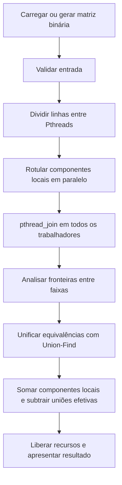
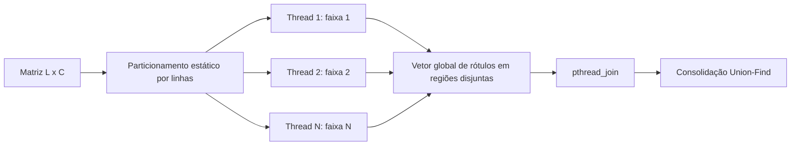
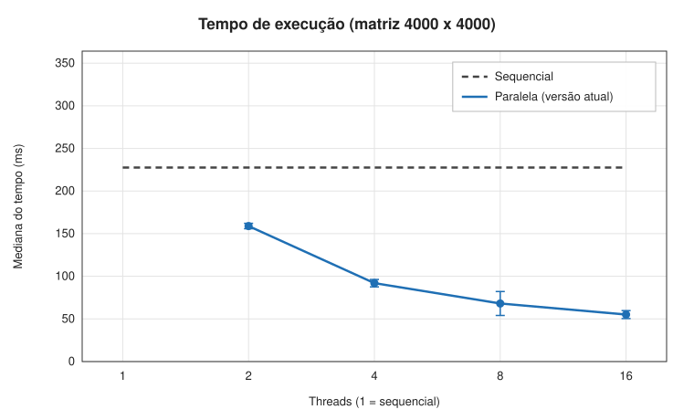
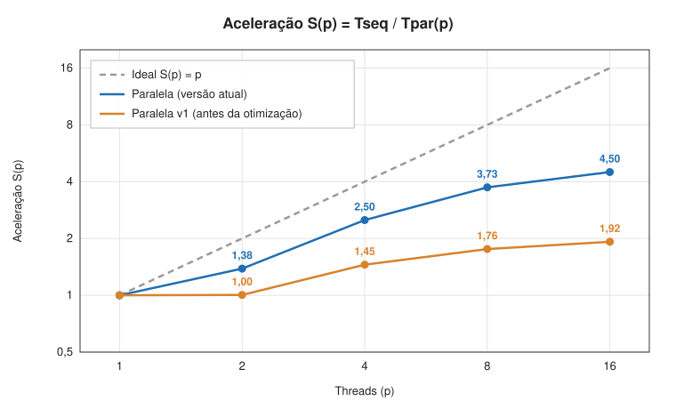
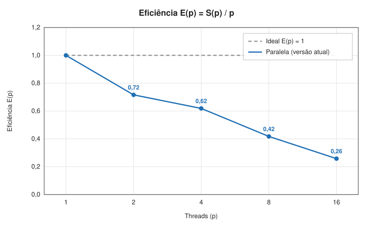
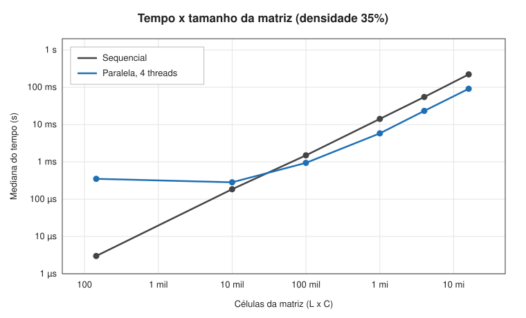

# Relatório técnico - Contagem paralela de objetos em uma matriz binária

> **Disciplina:** Sistemas Operacionais - 2026/II  
> **Professor:** Prof. Filipo Novo Mór  
> **Instituição:** Pontifícia Universidade Católica do Rio Grande do Sul - Escola Politécnica  
> **Repositório:** [Szeckir/t1_sisop](https://github.com/Szeckir/t1_sisop)  
> **Versão do relatório:** 1.1  
> **Data da revisão:** 06/10/2026

## Identificação

| Campo | Informação |
|---|---|
| Integrante 1 | Júlia Bettiol de Oliveira |
| Matrícula do integrante 1 | 23102448 |
| Integrante 2 | Thomaz Gomes Szeckir |
| Matrícula do integrante 2 | 23102712 |
| Modalidade | dupla |
| Turma | 33 |
| Estratégia paralela | Pthreads |
| Plataforma testada | Linux x86_64 |
| Commit avaliado | [`8e2c3ab198b9da875c66c8bfaf90a6b7b6f5fbba`](https://github.com/Szeckir/t1_sisop/commit/8e2c3ab198b9da875c66c8bfaf90a6b7b6f5fbba) (base do código e dos resultados; revisão documental local ainda não commitada) |

## Resumo

Este trabalho implementa a contagem de objetos em matrizes binárias segundo conectividade 8, em que células de valor `1` pertencem ao mesmo objeto quando se conectam horizontal, vertical ou diagonalmente. A versão sequencial percorre toda a matriz e utiliza flood fill iterativo com vetor de visitados, servindo como referência de correção e desempenho. A versão paralela utiliza Pthreads e divide a matriz estaticamente em faixas contíguas de linhas, permitindo que diferentes threads rotulem simultaneamente componentes locais em regiões disjuntas. Após `pthread_join()`, a thread principal consolida componentes que atravessam fronteiras por meio de Union-Find, verificando conexões verticais e diagonais entre faixas. A contagem global é a soma dos componentes locais menos o número de uniões efetivas, sem nova varredura completa da matriz. As cinco matrizes obrigatórias produziram os resultados esperados `3, 4, 5, 6 e 7` nas versões sequencial, com 2 threads e com 4 threads. Nos dados registrados para uma matriz pseudoaleatória 4000 x 4000, a mediana de cinco medições foi 234,624 ms no sequencial e 169,428 ms, 93,666 ms, 62,826 ms e 52,127 ms com 2, 4, 8 e 16 threads, respectivamente. A aceleração máxima observada foi 4,501, com eficiência de 0,281. Para matrizes pequenas, o custo de criação e sincronização das threads supera o benefício do paralelismo.

**Palavras-chave:** sistemas operacionais; paralelismo; threads; Pthreads; conectividade 8; flood fill; componentes conexos; Union-Find.

## 1. Visão geral do problema

O programa recebe uma matriz binária na qual `0` representa o fundo e `1` representa o primeiro plano. Um objeto corresponde a um componente de células de valor `1` conectadas horizontalmente, verticalmente ou diagonalmente, conforme a **conectividade 8**.

O projeto contém duas implementações funcionalmente equivalentes:

1. uma versão sequencial, usada como referência de correção e de desempenho;
2. uma versão paralela baseada em **Pthreads (POSIX Threads)**.

### 1.1 Objetivos da implementação

- Contar corretamente os objetos com conectividade 8.
- Distribuir trabalho efetivo entre pelo menos duas unidades de execução.
- Reconhecer e unificar objetos que atravessam as divisões da matriz.
- Produzir resultados determinísticos e idênticos nas versões sequencial e paralela.
- Evitar condições de corrida, deadlocks, atualizações perdidas e contagens duplicadas.
- Avaliar correção, sobrecarga, escalabilidade, aceleração e eficiência.

### 1.2 Requisitos atendidos

| Requisito | Como foi atendido | Evidência no repositório |
|---|---|---|
| ANSI C C89/C90 | Compilação com `-std=c89 -Wall -Wextra -pedantic` | `Makefile` |
| Conectividade 8 | Vetores de deslocamento com os oito vizinhos no flood fill | `src/conta-objetos-sequencial.c` e `src/conta-objetos-paralelo.c` |
| Versão sequencial | Flood fill iterativo e mapa de visitados | `src/conta-objetos-sequencial.c` |
| Versão paralela | Pthreads, rotulação local e consolidação global | `src/conta-objetos-paralelo.c` |
| Duas ou mais unidades concorrentes | Testes com 2 e 4 Pthreads | `make test` |
| Quantidade configurável de trabalhadores | Primeiro argumento da versão paralela | `./bin/paralelo 2 ...` ou `./bin/paralelo 4 ...` |
| Consolidação entre regiões | Union-Find após a fase paralela | `consolida_fronteiras()` e `uf_union()` |
| Tratamento horizontal, vertical e diagonal | Horizontal é resolvida no flood fill local; vertical e diagonais entre faixas são verificadas na consolidação | `consolida_fronteiras()` e testes 2, 3 e 5 |
| Verificação das chamadas POSIX | Retornos de `pthread_create`, `pthread_join` e `clock_gettime` verificados | fontes sequencial/paralela |
| Liberação dos recursos | `free()` das estruturas dinâmicas e `pthread_join()` das threads | fontes do projeto |
| Compilação reproduzível | Alvos `all`, `test`, `benchmark`, `graficos` e `clean` | `Makefile` |

## 2. Organização do repositório

```text
.
├── README.md
├── RELATORIO_TECNICO.md
├── Makefile
├── src/
│   ├── conta-objetos-sequencial.c
│   ├── conta-objetos-paralelo.c
│   ├── matriz.c
│   └── matriz.h
├── tests/
│   ├── obrigatorios/
│   │   └── ex1.txt ... ex5.txt
│   └── adicionais/
│       ├── a1_zeros.txt
│       ├── a2_objeto_unico.txt
│       └── a3_diagonal.txt
├── scripts/
│   ├── benchmark.sh
│   └── graficos.py
├── results/
│   ├── benchmark.txt
│   ├── medicoes.csv
│   ├── analise-desempenho.md
│   ├── testes-adicionais.txt
│   ├── grafico-tempo.svg
│   ├── grafico-aceleracao.svg
│   ├── grafico-eficiencia.svg
│   └── grafico-escala.svg
└── slides/
    └── apresentacao.pdf
```

| Caminho | Finalidade |
|---|---|
| `src/conta-objetos-sequencial.c` | Implementação sequencial de referência. |
| `src/conta-objetos-paralelo.c` | Implementação paralela com Pthreads e Union-Find. |
| `src/matriz.c` e `src/matriz.h` | Alocação, leitura, geração e operações auxiliares sobre matrizes. |
| `tests/obrigatorios/` | Cinco matrizes obrigatórias do enunciado. |
| `tests/adicionais/` | Casos extras para zeros, objeto cruzando regiões e diagonal. |
| `results/medicoes.csv` | Dados brutos das medições de desempenho. |
| `results/*.svg` | Gráficos gerados a partir dos dados brutos. |
| `scripts/benchmark.sh` | Execução repetida do benchmark. |
| `scripts/graficos.py` | Geração de gráficos SVG com a biblioteca padrão do Python 3. |
| `results/testes-adicionais.txt` | Registro das execuções dos três casos adicionais. |
| `slides/apresentacao.pdf` | Slides da apresentação. |

## 3. Ambiente de desenvolvimento e execução

### 3.1 Hardware e software

O ambiente das medições históricas é o declarado em [`results/analise-desempenho.md`](results/analise-desempenho.md). Os arquivos CSV e log registram tempos e contagens, mas não incluem uma captura independente das especificações da máquina.

| Item | Especificação declarada |
|---|---|
| Processador | Intel Core i7-14700HX |
| Núcleos físicos | 20: 8 de desempenho e 12 de eficiência |
| Processadores lógicos | 28 no processador; afinidade e quotas do WSL2 não registradas |
| Memória RAM | 15,7 GB |
| Sistema operacional | Windows 11 Pro com Ubuntu 26.04 LTS no WSL2 |
| Kernel Linux | 6.6.114.1 |
| Arquitetura | x86_64 |
| Compilador | GCC 15.2.0 |
| Padrão da linguagem | Sintaxe C89/C90 com APIs POSIX |
| APIs POSIX utilizadas | Pthreads (`pthread_create`, `pthread_join`) e `clock_gettime(CLOCK_MONOTONIC, ...)` |
| Flags de compilação | `-std=c89 -Wall -Wextra -pedantic -O2 -Isrc` e `-pthread` na versão paralela |

A revisão de 06/10/2026 recompilou e executou os testes no ambiente local **macOS/Darwin arm64, Apple Clang 17.0.0**. Essa execução valida o código atual; os tempos históricos foram preservados, sem substituir `results/medicoes.csv` ou `results/benchmark.txt`.

### 3.2 Compilação

```bash
make clean
make
```

Os comandos efetivos são:

```bash
cc -std=c89 -Wall -Wextra -pedantic -O2 -Isrc src/conta-objetos-sequencial.c src/matriz.c -o bin/sequencial
cc -std=c89 -Wall -Wextra -pedantic -O2 -Isrc -pthread src/conta-objetos-paralelo.c src/matriz.c -o bin/paralelo
```

### 3.3 Execução

```bash
./bin/sequencial tests/obrigatorios/ex3.txt
./bin/paralelo 2 tests/obrigatorios/ex3.txt
./bin/paralelo 4 tests/obrigatorios/ex3.txt
```

Para executar as cinco matrizes obrigatórias nas três configurações:

```bash
make test
```

Para o benchmark e os gráficos:

```bash
make benchmark
make graficos
```

`make benchmark` substitui os dados em `results/benchmark.txt` e `results/medicoes.csv`; `make graficos` usa o CSV existente. Para incluir a comparação histórica com a v1, é necessário fornecer um executável anterior por `PARALELO_ANTERIOR=<caminho> sh scripts/benchmark.sh`. Esse executável não está incluído no repositório atual.

### 3.4 Formato da entrada e da saída

Nos arquivos de teste, a primeira linha contém `L C`, correspondentes ao número de linhas e colunas. Em seguida devem aparecer `L*C` valores `0` ou `1`. O leitor rejeita dimensões não positivas, valores não binários e falta de células, mas não rejeita conteúdo excedente após as primeiras `L*C` células. A versão paralela recebe a quantidade de threads como primeiro argumento. Também é possível gerar uma matriz pseudoaleatória com `-g L C densidade semente`.

Exemplo de entrada:

```text
5 5
1 1 0 0 0
1 1 0 0 0
0 0 0 1 0
0 0 0 1 0
1 0 0 0 0
```

Exemplo de execução:

```bash
./bin/paralelo 4 tests/obrigatorios/ex1.txt
```

Resultado esperado: `3` objetos. A saída informa matriz/caso, esperado quando conhecido, resultado obtido e tempo em segundos. O valor esperado e o status `OK`/`FALHOU` são usados no modo automático das cinco matrizes; arquivos avulsos e matrizes geradas exibem `-` no campo esperado e não possuem gabarito automático.

## 4. Arquitetura da solução

### 4.1 Fluxo geral



### 4.2 Estruturas de dados principais

| Estrutura | Tipo/representação | Responsabilidade | Compartilhada? | Proteção utilizada |
|---|---|---|---|---|
| Matriz de entrada | `int *`, vetor 1D de `L*C` | Armazenar `0` e `1` | Sim, somente leitura | Não necessária |
| Visitados (sequencial) | vetor auxiliar | Distinguir células já percorridas | Não | Não se aplica |
| Rótulos (paralelo) | `int *rotulos` | Guardar identificador do componente local de cada célula | Sim | Escrita disjunta por faixas + `pthread_join` antes da leitura global |
| Pilha do flood fill | `int *` por trabalhador | Percorrer iterativamente cada componente | Não | Não se aplica |
| Trabalho por thread | `Trabalho` | Guardar faixa `[linha_ini, linha_fim)` e referências necessárias | Cada thread recebe sua estrutura | Não se aplica |
| Union-Find | `int *pai` e `unsigned char *rank` | Consolidar componentes locais equivalentes | `pai` inicializado em posições disjuntas pelos trabalhadores; uniões após os joins | Escrita disjunta na inicialização e uniões somente na thread principal |
| Contador de componentes | `int componentes` local e campo de `Trabalho` | Registrar o número de componentes de cada faixa | Cada trabalhador publica seu próprio total ao terminar | Principal lê somente após os joins |

## 5. Implementação sequencial

### 5.1 Algoritmo

A versão sequencial percorre as `L*C` células em ordem. Ao encontrar uma célula de valor `1` ainda não visitada, incrementa a contagem de objetos e inicia um flood fill iterativo. A célula inicial é marcada antes de entrar na pilha, evitando inserções duplicadas. Para cada célula removida da pilha são testados os oito deslocamentos vizinhos: três superiores, esquerda, direita e três inferiores. Um vizinho só é inserido quando está dentro dos limites, possui valor `1` e ainda não foi visitado. Dessa forma, todas as células de um componente são marcadas exatamente uma vez. O uso de pilha dinâmica evita depender da pilha de chamadas do processo em componentes grandes.

### 5.2 Pseudocódigo

```text
FUNÇÃO contar_objetos_sequencial(matriz, L, C):
    criar vetor visitado[L*C] inicializado com zero
    criar pilha com capacidade L*C
    objetos <- 0

    PARA cada célula i da matriz:
        SE matriz[i] = 1 E visitado[i] = 0:
            objetos <- objetos + 1
            marcar i como visitada
            empilhar i

            ENQUANTO pilha não estiver vazia:
                atual <- desempilhar
                PARA cada um dos 8 vizinhos de atual:
                    SE vizinho está dentro da matriz E
                       matriz[vizinho] = 1 E visitado[vizinho] = 0:
                        marcar vizinho como visitado
                        empilhar vizinho

    liberar estruturas auxiliares
    RETORNAR objetos
```

### 5.3 Complexidade e uso de memória

| Aspecto | Análise | Justificativa |
|---|---|---|
| Complexidade de tempo | `O(L*C)` | Cada célula é visitada no máximo uma vez e cada visita testa oito vizinhos, constante. |
| Complexidade de espaço | `O(L*C)` | Vetor de visitados e pilha podem crescer proporcionalmente ao número de células. |
| Risco de recursão excessiva | Não existe na implementação | Flood fill é iterativo, usando pilha alocada dinamicamente. |

## 6. Implementação paralela

### 6.1 Modelo de concorrência

| Decisão | Escolha do grupo | Justificativa |
|---|---|---|
| Unidade de execução | Thread POSIX | Compartilhamento natural da matriz e dos rótulos, com menor custo de comunicação que processos separados. |
| Quantidade de trabalhadores | Argumento da linha de comando, mínimo 2 | Permite testar diferentes níveis de paralelismo. |
| Divisão do trabalho | Faixas contíguas de linhas | Simples, determinística e garante regiões de escrita disjuntas. |
| Escalonamento | Estático | As faixas são definidas antes de `pthread_create`. |
| Comunicação | Memória compartilhada do processo | Matriz e vetor de rótulos são visíveis a todas as Pthreads. |
| Sincronização | `pthread_join()` | Atua como barreira entre rotulação local e consolidação; mutex não é necessário porque as escritas locais são disjuntas e o Union-Find é sequencial. |

### 6.2 Decomposição da matriz

Se `L` é o número de linhas e `T` a quantidade de threads, calcula-se `base = L/T` e `resto = L%T`. Cada trabalhador recebe `base` linhas e as primeiras `resto` threads recebem uma linha adicional. Assim, a diferença entre o número de linhas de quaisquer duas faixas é no máximo uma. Se o usuário solicitar mais threads que linhas, a implementação limita o número efetivo de trabalhadores a `L`; a versão paralela exige pelo menos duas linhas/unidades para manter o requisito de paralelismo.



### 6.3 Paralelismo efetivo

O cálculo efetivamente paralelo é a identificação e rotulação dos componentes locais. Cada Pthread percorre e executa flood fill apenas nas linhas atribuídas a ela. Portanto, não são threads criadas apenas para cumprir formalmente o requisito: cada uma realiza uma parcela real da varredura e da exploração de componentes.

| Etapa | Sequencial ou paralela? | Unidade responsável | Motivo |
|---|---|---|---|
| Leitura/geração da matriz | Sequencial | Thread principal | Ocorre antes da decomposição. |
| Particionamento | Sequencial | Thread principal | Custo pequeno e necessário para definir os trabalhos. |
| Identificação local | **Paralela** | Todas as Pthreads | Principal parcela de cálculo distribuída. |
| Análise das fronteiras | Sequencial | Thread principal | Executada após todos os joins para simplificar correção. |
| Consolidação | Sequencial | Thread principal | Union-Find é atualizado sem concorrência. |
| Contagem final | Sequencial | Thread principal | Soma os contadores locais e subtrai as uniões efetivas, sem varrer novamente as células. |

### 6.4 Sincronização, comunicação e regiões críticas

| Recurso/dado | Risco concorrente | Mecanismo usado | Escopo da proteção | Justificativa |
|---|---|---|---|---|
| Matriz de entrada | Escrita concorrente | Nenhum | Somente leitura | Nenhuma thread modifica a matriz. |
| Vetor `rotulos` | Condição de corrida se duas threads escrevessem na mesma célula | Particionamento disjunto | Cada thread escreve apenas suas linhas | Não existe sobreposição de escrita. |
| Pilha de flood fill | Compartilhamento indevido | Uma pilha por thread | Privada ao trabalhador | Elimina disputa. |
| Union-Find | Escritas sobrepostas em `pai` ou uniões concorrentes | Trabalhadores inicializam somente `pai[r] = r` de seus próprios rótulos; principal realiza as uniões após os joins | Posições disjuntas na fase local; consolidação sequencial | Rótulos globais únicos garantem que a inicialização não se sobreponha. |
| Transição fase local -> consolidação | Leitura de rótulos ainda sendo escritos | `pthread_join()` | Todas as threads | A consolidação só começa quando os trabalhadores terminaram. |

Não há deadlock porque a implementação não adquire múltiplos mutexes, semáforos ou locks. O único ponto de espera é `pthread_join()`, usado pela thread principal para aguardar o término de cada trabalhador. Cada trabalhador termina independentemente após concluir sua faixa.

## 7. Consolidação dos componentes

Somar as contagens locais seria incorreto: um objeto pode iniciar em uma faixa e continuar na seguinte, sendo temporariamente rotulado como dois componentes diferentes. A solução separa a identificação local da consolidação global.

### 7.1 Identificação local

Cada componente local recebe como rótulo `indice_global_da_celula_inicial + 1`. Como o índice da célula é global e único na matriz, componentes descobertos por threads diferentes não recebem acidentalmente o mesmo identificador. O trabalhador inicializa `pai[rotulo] = rotulo` ao descobrir cada componente; as demais posições de `pai` não precisam ser inicializadas porque não são consultadas. O vetor `rank` é zerado antes da criação das threads. Durante o flood fill local, o rótulo é propagado apenas dentro da faixa atribuída ao trabalhador.

### 7.2 Verificação das fronteiras

Como a decomposição utilizada é exclusivamente por **faixas de linhas**, existem fronteiras horizontais entre trabalhadores. Não há fronteiras verticais entre regiões de trabalho. Para cada célula `1` da última linha da faixa superior, são verificadas na primeira linha da faixa inferior as posições `c-1`, `c` e `c+1`, quando válidas.

| Situação | Pares de células verificados | Como a equivalência é registrada |
|---|---|---|
| Fronteira horizontal entre faixas | última linha superior x primeira linha inferior | `uf_union(rotulo_a, rotulo_b)` quando ambas são `1` |
| Conexão vertical | `(linha_sup,c)` com `(linha_inf,c)` | União dos rótulos |
| Conexão diagonal | `(linha_sup,c)` com `(linha_inf,c-1)` e `(linha_inf,c+1)` | União dos rótulos |
| Conexão horizontal | Células `c-1`/`c+1` na mesma faixa | Já resolvida pelo flood fill local |
| Encontro equivalente ao caso de quatro blocos | Na decomposição por linhas não há quatro blocos; o caso crítico equivalente é a conexão diagonal atravessando a fronteira | Comparações `c-1` e `c+1` preservam a conectividade 8 |

### 7.3 Unificação e contagem global

A estrutura Disjoint Set Union (Union-Find) mantém um vetor `pai` e um vetor de rank. `uf_find()` aplica compressão de caminho; `uf_union()` usa rank e retorna `1` apenas quando une duas raízes distintas, ou `0` quando os rótulos já pertencem ao mesmo conjunto.

Cada trabalhador conta seus componentes em uma variável local e publica o total em `trab[i].componentes` ao terminar. Após os joins, a principal soma esses totais. `consolida_fronteiras()` acumula apenas as uniões efetivas, e o resultado é:

```text
objetos = soma dos componentes locais - unioes efetivas
```

Inicialmente, cada componente local representa um conjunto. Cada união efetiva reduz o número de conjuntos em exatamente um; conexões repetidas entre conjuntos já unidos não alteram a contagem. Assim, a fórmula conta os componentes globais sem vetor `visto` e sem uma nova varredura de `L*C` células. A fase após os joins soma `T` contadores e verifica até `3*(T-1)*C` pares de fronteira, com custo amortizado das operações Union-Find. A memória auxiliar total continua sendo `O(L*C + T)`, incluindo as pilhas por faixa. As alocações e inicializações de `rotulos` e `rank` ainda fazem parte do tempo medido.

### 7.4 Exemplo rastreável

Considere o **Exemplo 2 (6 x 8)** executado com 2 threads. As faixas são `[0,3)` e `[3,6)`, com divisão entre as linhas 2 e 3 (índices a partir de zero).

| Região | Componentes locais (rótulos) | Células de fronteira do componente central |
|---|---|---|
| Faixa superior | 2: `7` e `10` | `(2,2)` e `(2,3)`, rótulo `10` |
| Faixa inferior | 3: `28`, `40` e `41` | `(3,3)` e `(3,4)`, rótulo `28` |

A comparação diagonal `(2,2)` com `(3,3)` une os rótulos `10` e `28`. As comparações `(2,3)` com `(3,3)` e `(3,4)` reencontram conjuntos já unidos e retornam `0` em `uf_union()`. Logo, a soma local é `2+3=5`, há uma união efetiva e a contagem final é `5-1=4` objetos, igual ao sequencial e ao paralelo com 4 threads.

## 8. Correção e testes funcionais

### 8.1 Procedimento de validação

As versões foram compiladas pelo mesmo `Makefile`. As cinco matrizes obrigatórias foram executadas na versão sequencial e na paralela com 2 e 4 threads. O resultado obtido foi comparado ao valor esperado do enunciado. Também foram criados casos adicionais para matriz preenchida apenas com zeros, objeto único cruzando várias linhas/faixas e conexão exclusivamente diagonal. A igualdade entre resultados em configurações diferentes evidencia o determinismo da estratégia; as regiões de escrita são disjuntas e a consolidação ocorre somente após os joins.

### 8.2 Matrizes obrigatórias

| Exemplo | Dimensões | Objetos esperados | Resultado sequencial | Paralelo 2 threads | Paralelo 4 threads | Situação | Evidência |
|---:|---:|---:|---:|---:|---:|---|---|
| 1 | 5 x 5 | 3 | 3 | 3 | 3 | Aprovado | `tests/obrigatorios/ex1.txt` |
| 2 | 6 x 8 | 4 | 4 | 4 | 4 | Aprovado | `tests/obrigatorios/ex2.txt` |
| 3 | 8 x 8 | 5 | 5 | 5 | 5 | Aprovado | `tests/obrigatorios/ex3.txt` |
| 4 | 9 x 12 | 6 | 6 | 6 | 6 | Aprovado | `tests/obrigatorios/ex4.txt` |
| 5 | 12 x 12 | 7 | 7 | 7 | 7 | Aprovado | `tests/obrigatorios/ex5.txt` |

### 8.3 Casos de teste adicionais

| ID | Dimensões | Característica avaliada | Referência | Configurações paralelas | Resultado obtido | Situação |
|---|---:|---|---:|---|---:|---|
| A1 | 4 x 5 | Somente zeros | 0 | 2 e 4 threads | 0 | Aprovado |
| A2 | 8 x 8 | Um único objeto diagonal atravessando várias regiões | 1 | 2 e 4 threads | 1 | Aprovado |
| A3 | 6 x 6 | Conexões somente diagonais | 1 | 2 e 4 threads | 1 | Aprovado |
| A4 | 4000 x 4000 | Matriz pseudoaleatória usada no desempenho histórico | 489760 (sequencial no Linux) | 2, 4, 8 e 16 threads | 489760 | Aprovado |
| A5 | 12 x 12 (Ex. 5) | Travessia diagonal longa entre regiões | 7 | 2 e 4 threads | 7 | Aprovado |

### 8.4 Repetibilidade e determinismo

| Teste | Repetições | Configurações | Resultados idênticos? | Observações |
|---|---:|---|---|---|
| Benchmark 4000 x 4000, densidade 35%, semente 2026 | 5 por configuração | sequencial; paralela atual e v1 com 2, 4, 8 e 16 threads | Sim | Todas as 45 execuções retornaram 489760 objetos. |

### 8.5 Validação da revisão de 06/10/2026

A revisão local recompilou os programas com `make -B test`, sem erros ou avisos, e repetiu os cinco testes obrigatórios em sequencial, 2 e 4 threads (15 execuções), além dos três adicionais nas mesmas configurações (9 execuções). Todos retornaram os valores esperados.

Também foram geradas 60 matrizes binárias com semente 2026 no gerador de testes Python, entre 2 e 19 linhas e entre 1 e 19 colunas, com densidades variadas. Uma implementação independente de conectividade 8 calculou o gabarito. O sequencial e o paralelo com 2, 4, 8 e 16 threads passaram em todas as 300 comparações, incluindo casos em que a quantidade solicitada excedia as linhas. Esse ensaio foi executado durante a revisão; seu gerador temporário não integra o repositório.

Na matriz gerada por `-g 4000 4000 35 2026`, o macOS retornou **487159 objetos** nas cinco configurações, contra **489760** nos dados históricos do Linux. Isso é compatível com sequências diferentes de `rand()` nas bibliotecas C das plataformas: os dados de entrada mudam entre ambientes, enquanto a igualdade entre sequencial e paralelo foi preservada dentro de cada ambiente.

Os 105 registros históricos do CSV foram confrontados, em ordem, com o log: contagens idênticas e tempos equivalentes após conversão de segundos para milissegundos. Medianas, desvios-padrão amostrais, acelerações e eficiências deste relatório foram recalculados a partir do CSV. Os quatro gráficos SVG foram comparados à geração feita pelo script com esse CSV, com conteúdo idêntico.

## 9. Avaliação de desempenho

### 9.1 Metodologia experimental

| Parâmetro | Valor adotado |
|---|---|
| Matriz | 4000 x 4000, pseudoaleatória, densidade 35%, semente 2026 |
| Mesmos dados em todas as versões? | Sim, no mesmo ambiente e biblioteca C, usando a mesma semente e parâmetros. `rand()` não garante a mesma sequência entre bibliotecas C diferentes. |
| Relógio/API de medição | `clock_gettime(CLOCK_MONOTONIC, ...)` |
| Trecho medido | Rotina completa de contagem de cada versão, incluindo alocações/liberações auxiliares, criação/join das threads e consolidação; geração/leitura da matriz e impressão ficam fora. |
| Aquecimentos descartados | Nenhum |
| Repetições por configuração | 5, intercalando as configurações a cada repetição |
| Configurações principais | Sequencial; paralela atual e v1 com 2, 4, 8 e 16 threads |
| Ensaio por tamanho | 12, 100, 316, 1000, 2000 e 4000 linhas/colunas; sequencial contra 4 threads |
| Medida representativa | Mediana |
| Critério para dispersão | Desvio-padrão amostral, informado nas tabelas/gráfico |
| Carga do sistema durante os testes | Não foi controlada externamente; a mediana reduz a influência de variações ocasionais. |
| Flags de otimização | `-O2` |

As medições brutas estão em [`results/medicoes.csv`](results/medicoes.csv) e o log original em [`results/benchmark.txt`](results/benchmark.txt).

### 9.2 Métricas

A aceleração para `p` trabalhadores é:

$$S(p) = T_{sequencial}/T_{paralelo}(p)$$

A eficiência é:

$$E(p) = S(p)/p$$

### 9.3 Resultados consolidados da versão atual

| Versão | Trabalhadores (`p`) | Mediana (ms) | Desvio-padrão amostral (ms) | Aceleração `S(p)` | Eficiência `E(p)` | Correto? |
|---|---:|---:|---:|---:|---:|---|
| Sequencial | 1 | 234,624 | 13,482 | 1,000 | 1,000 | Sim |
| Paralela | 2 | 169,428 | 5,563 | 1,385 | 0,692 | Sim |
| Paralela | 4 | 93,666 | 5,704 | 2,505 | 0,626 | Sim |
| Paralela | 8 | 62,826 | 3,329 | 3,735 | 0,467 | Sim |
| Paralela | 16 | 52,127 | 6,015 | 4,501 | 0,281 | Sim |

### 9.4 Dados brutos das repetições (matriz grande)

| Versão | Trabalhadores | Rep. 1 (ms) | Rep. 2 (ms) | Rep. 3 (ms) | Rep. 4 (ms) | Rep. 5 (ms) | Mediana (ms) |
|---|---:|---:|---:|---:|---:|---:|---:|
| sequencial | 1 | 257,860 | 237,813 | 234,624 | 224,341 | 225,605 | 234,624 |
| paralela | 2 | 177,419 | 174,511 | 169,428 | 163,707 | 166,955 | 169,428 |
| paralela | 4 | 93,666 | 103,066 | 92,005 | 101,324 | 90,475 | 93,666 |
| paralela | 8 | 64,085 | 61,173 | 62,826 | 68,671 | 60,115 | 62,826 |
| paralela | 16 | 53,665 | 52,127 | 51,916 | 49,027 | 64,601 | 52,127 |
| paralela-v1 | 2 | 255,224 | 233,466 | 233,624 | 219,788 | 218,461 | 233,466 |
| paralela-v1 | 4 | 160,841 | 162,093 | 162,186 | 159,021 | 161,433 | 161,433 |
| paralela-v1 | 8 | 133,500 | 129,077 | 142,383 | 135,044 | 120,433 | 133,500 |
| paralela-v1 | 16 | 122,051 | 123,069 | 112,916 | 116,383 | 128,243 | 122,051 |

### 9.5 Gráfico de tempo de execução



**Figura 1 -** Mediana do tempo de execução por quantidade de trabalhadores. As barras de erro das curvas paralelas representam o desvio-padrão amostral das cinco repetições; a referência sequencial é uma linha na sua mediana. As curvas distinguem a versão atual da v1. Fonte: elaborado a partir de `results/medicoes.csv`.

### 9.6 Gráfico de aceleração



**Figura 2 -** Aceleração da versão atual e da v1, com referência ideal `S(p)=p`. Fonte: elaborado a partir de `results/medicoes.csv`.

### 9.7 Gráfico de eficiência



**Figura 3 -** Eficiência da versão atual e da v1, `E(p)=S(p)/p`. Fonte: elaborado a partir de `results/medicoes.csv`.

### 9.8 Análise dos resultados

Na matriz 4000 x 4000 do ambiente registrado, a versão atual superou a sequencial em todas as quantidades testadas. A mediana caiu de 234,624 ms para 169,428 ms com 2 threads e 52,127 ms com 16 threads. A aceleração aumentou de 1,385 para 4,501, mas a eficiência caiu de 0,692 para 0,281: aumentar trabalhadores melhora o tempo total, com retornos decrescentes.

Ainda existem custos de alocação e inicialização de estruturas, criação e espera das Pthreads e consolidação das fronteiras pela thread principal. O flood fill exige muitos acessos à memória, e o particionamento estático pode sofrer com diferenças de densidade e velocidade dos núcleos. Esses fatores são explicações plausíveis para a aceleração abaixo do ideal; não houve instrumentação por fase, medição de largura de banda ou registro de afinidade que permita atribuir quantitativamente o custo a cada fator. A quantidade de threads, por si só, não comprova o uso de hyper-threading, pois isso depende do escalonamento.

### 9.9 Comparação histórica com a v1

Os dados da versão anterior estão identificados como `paralela-v1` no CSV e no log. Segundo a análise histórica em `results/analise-desempenho.md`, a v1 inicializava todo o vetor `pai` e fazia uma varredura global de rótulos para contar raízes. O código atual inicializa `pai` nos trabalhadores e calcula a contagem pela soma local menos uniões efetivas. O código-fonte/executável da v1 não está presente nesta revisão; seus tempos são registros históricos, e não resultados de uma nova execução da v1.

| Threads | Mediana v1 (ms) | `S(p)` v1 | Mediana atual (ms) | `S(p)` atual | Ganho atual sobre v1 |
|---:|---:|---:|---:|---:|---:|
| 2 | 233,466 | 1,005 | 169,428 | 1,385 | 1,38x |
| 4 | 161,433 | 1,453 | 93,666 | 2,505 | 1,72x |
| 8 | 133,500 | 1,757 | 62,826 | 3,735 | 2,12x |
| 16 | 122,051 | 1,922 | 52,127 | 4,501 | 2,34x |

### 9.10 Efeito do tamanho da matriz

O segundo ensaio usa a mesma densidade e semente, com cinco repetições por tamanho, comparando sequencial e 4 threads. Trata-se de uma série separada do ensaio principal, por isso as medianas de 4000 x 4000 diferem entre as séries.

| Matriz | Células | Mediana sequencial (ms) | Mediana paralela 4 threads (ms) | `S(4)` | Objetos em ambas |
|---|---:|---:|---:|---:|---:|
| 12 x 12 | 144 | 0,003 | 0,351 | 0,01 | 9 |
| 100 x 100 | 10000 | 0,185 | 0,283 | 0,65 | 308 |
| 316 x 316 | 99856 | 1,494 | 0,940 | 1,59 | 3135 |
| 1000 x 1000 | 1000000 | 14,141 | 5,804 | 2,44 | 30848 |
| 2000 x 2000 | 4000000 | 54,892 | 23,241 | 2,36 | 123036 |
| 4000 x 4000 | 16000000 | 221,577 | 90,990 | 2,44 | 489760 |



**Figura 4 -** Medianas de tempo para tamanhos crescentes, em eixos logarítmicos. Fonte: `results/medicoes.csv`.

Para 12 x 12 e 100 x 100, o paralelo foi mais lento: o trabalho útil é pequeno frente à preparação e sincronização. Entre os tamanhos medidos, a primeira vantagem ocorreu em 316 x 316 (99.856 células), com aceleração de aproximadamente 1,59. Para um milhão de células ou mais, a aceleração com 4 threads ficou entre 2,36 e 2,44. Esse intervalo de transição vale para o ambiente e distribuição testados; não é um limite universal.

## 10. Tratamento de erros e qualidade do código

### 10.1 Chamadas e recursos POSIX

| Chamada/recurso | Erro verificado? | Ação em caso de falha | Liberação/finalização |
|---|---|---|---|
| `pthread_create` | Sim | Registra erro e impede consolidação como se todas as threads tivessem sido criadas | Threads já criadas são aguardadas |
| `pthread_join` | Sim | Registra código de erro e impede consolidação | No fluxo normal, aguarda cada thread; em falha de join, o código não garante que o trabalhador terminou antes de liberar estruturas |
| `clock_gettime` | Sim | `perror`/tratamento previsto na função de tempo | Não se aplica |
| `malloc/calloc` | Sim | Mensagem de erro e retorno seguro | `free` antes da saída |
| `fopen` / `fscanf` | Sim | Mensagem e cancelamento da leitura quando inválida | Arquivo fechado e matriz liberada nos caminhos de erro de leitura |
| `fclose` / `fprintf` | Parcial | `fclose` verificado em `matriz_salvar`; não verificado em `matriz_ler`; retornos de `fprintf` não verificados | Não há tratamento completo de erros de escrita/fechamento |
| Mutex/semaforo | Não se aplica | Não são necessários nesta arquitetura | Não se aplica |

### 10.2 Compilação e análise

| Verificação | Comando/ferramenta | Resultado |
|---|---|---|
| Compilação C89/C90 | `make -B test` na revisão de 06/10/2026 | Recompilação com Apple Clang 17.0.0, sem erros |
| Avisos do compilador | `-Wall -Wextra -pedantic` | Nenhum aviso observado na compilação registrada |
| Vazamentos de memória | `README.md` relata execução histórica de `valgrind --leak-check=full` | Relato de zero erros e ausência de vazamentos; logs Valgrind não incluídos e ferramenta não reexecutada nesta revisão |
| Condições de corrida | Análise das escritas disjuntas e testes; `README.md` relata Helgrind/DRD | Arquitetura consistente no fluxo normal; relato histórico de zero erros, sem logs incluídos |

### 10.3 Separação de responsabilidades

`matriz.c/.h` concentra alocação, leitura e geração de matrizes. `conta-objetos-sequencial.c` contém a referência de correção e seu flood fill. `conta-objetos-paralelo.c` concentra decomposição, trabalhadores Pthreads, rotulação local, Union-Find e consolidação. `scripts/benchmark.sh` separa a repetição experimental do algoritmo. `results/` guarda dados e análise, enquanto `tests/` mantém as entradas reproduzíveis.

## 11. Limitações e decisões de projeto

| Limitação ou decisão | Impacto | Alternativa considerada | Motivo da escolha |
|---|---|---|---|
| Particionamento estático por linhas | Pode haver desequilíbrio quando algumas faixas possuem muito mais componentes/células `1` | Fila dinâmica de blocos | Faixas simplificam propriedade dos rótulos e consolidação correta |
| Consolidação sequencial | Limita o speedup para matrizes muito grandes | Union-Find concorrente com locks | Evita races e mantém a lógica determinística e explicável |
| Union-Find proporcional à matriz/rótulos | Aumenta consumo de memória | Tabela esparsa de componentes locais | Vetores simples são previsíveis e eficientes em acesso |
| Sem mutex na fase local | Exige garantir rigorosamente regiões disjuntas | Mutex global ou por região | Locks seriam desnecessários e adicionariam contenção |
| Benchmark com uma densidade (35%) e seis dimensões | Não caracteriza todas as distribuições possíveis | Várias densidades e padrões de componentes | Mantém o experimento reproduzível; pode ser expandido futuramente |
| Dimensões e argumentos convertidos com `int`/`atoi` | Não há proteção completa contra overflow em `L*C` nem contra argumentos numéricos malformados | Conversão validada e checagem de limites antes da alocação | Limitação do código atual; testes usam dimensões dentro dos limites |
| Falha de `pthread_join` | Liberação pode ocorrer sem confirmação do término do trabalhador | Garantir término antes de liberar dados compartilhados | Limitação do caminho excepcional; não exercitado nos testes |
| Uso de `rand()` | Semente não produz necessariamente a mesma matriz em Linux e macOS | Gerador com algoritmo explicitamente definido ou arquivo de matriz comum | Reprodutibilidade garantida apenas na mesma implementação da biblioteca C |

## 12. Conclusão

Os objetivos funcionais foram atingidos. A implementação sequencial conta componentes conexos com conectividade 8 por flood fill iterativo, enquanto a versão paralela distribui trabalho real entre Pthreads por faixas de linhas. A consolidação com Union-Find corrige o problema central de objetos que atravessam as divisões. As cinco matrizes obrigatórias retornaram exatamente `3, 4, 5, 6 e 7` objetos nas versões sequencial, 2 threads e 4 threads. Os casos adicionais também confirmaram matriz preenchida apenas com zeros, conexão diagonal e componente atravessando múltiplas regiões.

O experimento de desempenho mostrou aceleração para matrizes grandes na versão atual: as medianas do ensaio principal foram 234,624 ms no sequencial e 169,428 ms, 93,666 ms, 62,826 ms e 52,127 ms com 2, 4, 8 e 16 trabalhadores. A aceleração máxima foi 4,501, sem escala linear. No ensaio por tamanho, o paralelo foi mais lento em 12 x 12 e 100 x 100; o benefício apareceu a partir do tamanho medido de 316 x 316. A redução de etapas sequenciais na contagem final ajuda a explicar o ganho em relação aos registros da v1.

O principal aprendizado é decompor dados sem sobreposição, aguardar os trabalhadores antes da consolidação e distinguir componentes locais de objetos globais. Como evolução, a solução pode comparar distribuições de entrada, escalonamento por blocos e outras formas de consolidação. Também permanecem melhorias no tratamento de overflow de dimensões, validação de argumentos e falhas excepcionais de `pthread_join`.

## 13. Vídeo de apresentação

| Campo | Informação |
|---|---|
| Plataforma | YouTube |
| Link da apresentação | [Vídeo do trabalho](https://www.youtube.com/watch?v=fNzSmvmrRsY) |
| Duração | 8 minutos e 42 segundos |
| Privacidade | Não listado|
| Senha, se aplicável | Não se aplica |

### 13.1 Conteúdo do vídeo

- [ x ] Problema e estratégia escolhida.
- [ x ] Implementação sequencial e referência de correção.
- [ x ] Decomposição, Pthreads e sincronização.
- [ x ]  Consolidação de objetos que atravessam regiões.
- [ x ] Demonstração executável.
- [ x ] Testes obrigatórios e adicionais.
- [ x ] Resultados de desempenho.
- [ x ] Conclusões.
- [ x ] Participação de ambos os integrantes, quando o trabalho for em dupla.

## 14. Contribuições dos integrantes

| Atividade | Júlia Bettiol de Oliveira | Thomaz Gomes Szeckir | Artefato relacionado |
|---|---|---|---|
| Projeto da solução sequencial | Participação conjunta | Participação conjunta | `src/conta-objetos-sequencial.c` |
| Projeto da solução paralela | Participação conjunta | Participação conjunta | `src/conta-objetos-paralelo.c` |
| Sincronização/comunicação | Participação conjunta | Participação conjunta | Pthreads e particionamento disjunto |
| Consolidação | Participação conjunta | Participação conjunta | Union-Find |
| Testes e medições | Participação conjunta | Participação conjunta | `tests/` e `results/` |
| Documentação e apresentação | Participação conjunta | Participação conjunta | `README.md`, relatório e `slides/` |

Todos os integrantes devem compreender integralmente o código, as estruturas de dados, a divisão do trabalho, a sincronização, a comunicação, a consolidação e os resultados apresentados.

## 15. Ferramentas, bibliotecas, referências e códigos externos

| Recurso | Finalidade | Origem/link | Licença, quando aplicável | Partes do projeto afetadas |
|---|---|---|---|---|
| POSIX Threads (Pthreads) | Criação e sincronização de threads | API POSIX disponível no Linux/macOS | Padrão POSIX | Versão paralela |
| `clock_gettime` | Medição monotônica do tempo | API POSIX | Padrão POSIX | Medição de desempenho |
| Material da disciplina | Conceitos de processos, threads, Pthreads, comunicação e sincronização | Material fornecido pelo professor | Material acadêmico | Projeto e documentação |
| Enunciado do trabalho | Requisitos, matrizes e critérios de avaliação | PUCRS / disciplina | Material acadêmico | Todo o projeto |
| ChatGPT/Codex (OpenAI) | Apoio na revisão, documentação, estruturação da solução, testes e gráficos/relatório | Ferramenta declarada no README e utilizada nesta revisão | Serviço externo | Documentação e apoio ao desenvolvimento; código recompilado e resultados conferidos |
| Claude Code (Anthropic) | Revisão frente ao enunciado e otimização da contagem final paralela | Ferramenta declarada no `README.md` | Serviço externo | Revisão e otimização da versão paralela |
| Python 3 | Processar CSV e gerar gráficos SVG | Biblioteca padrão (`csv`, `statistics`, entre outras) | Licença do Python | `scripts/graficos.py` |
| Valgrind (Memcheck, Helgrind, DRD) | Verificação dinâmica de memória e concorrência | Uso histórico relatado no `README.md` | Ferramenta externa | Verificação das versões sequencial/paralela; logs não incluídos |

Não foram usadas bibliotecas externas para implementar o algoritmo de contagem ou a estrutura Union-Find.

## 16. Checklist de entrega

### Código e execução

- [x] O código segue ANSI C C89/C90.
- [x] O projeto compila em Linux.
- [x] A compilação ocorre sem erros e sem avisos observados com as flags exigidas.
- [x] `pthread_create`, `pthread_join` e `clock_gettime` têm retornos verificados; limitações de arquivo/join descritas na seção 10.
- [x] Os recursos dinâmicos são finalizados ou liberados corretamente no fluxo normal.
- [x] A versão sequencial conta componentes com conectividade 8.
- [x] A versão paralela distribui cálculo real entre pelo menos duas unidades.
- [x] A quantidade de threads é configurável.
- [x] Conexões horizontais, verticais e diagonais são preservadas.
- [x] Componentes que atravessam regiões são consolidados sem duplicidade.
- [x] Não há condições de corrida, deadlocks ou atualizações perdidas conhecidas na arquitetura utilizada.

### Testes e desempenho

- [x] As cinco matrizes obrigatórias foram executadas nas duas versões.
- [x] A versão paralela produziu exatamente os mesmos resultados da sequencial.
- [x] Foi usada matriz maior para teste de desempenho.
- [x] Foram testadas pelo menos duas quantidades de threads (2 e 4).
- [x] As medições foram repetidas cinco vezes e a mediana foi adotada.
- [x] Tempo sequencial, tempo paralelo, aceleração e eficiência foram informados.
- [x] O custo maior do paralelo nas matrizes pequenas foi explicado.
- [x] Dados brutos, tabelas e gráficos estão incluídos.

### Repositório e apresentação

- [x] O [repositório do GitHub](https://github.com/Szeckir/t1_sisop) está público; consulta realizada em 06/10/2026.
- [x] `README.md` identifica os dois integrantes, com o nome Thomaz Gomes Szeckir corrigido na revisão local.
- [x] O `Makefile` permite compilação reproduzível.
- [x] As matrizes de teste e seus resultados estão incluídos.
- [x] A análise de desempenho está incluída.
- [x] Os slides estão em `slides/apresentacao.pdf`.
- [x] O link do vídeo informado pelos autores foi incluído na seção 13.
- [x] Duração de 8min42s e privacidade não listada informadas pelos autores.
- [ ] Reprodução e conteúdo do vídeo conferidos; acesso automatizado impedido pela verificação contra bots do YouTube.
- [x] Ferramentas, referências, bibliotecas e códigos externos estão identificados neste relatório.
- [x] O hash base do código e dos resultados foi registrado na identificação.
- [ ] A revisão documental local foi incluída no commit de entrega; este relatório ainda não está commitado.

## Apêndice A - Registro de comandos

```bash
# Informações do ambiente
uname -a
cc --version
lscpu
free -h

# Compilação
make clean
make

# Testes obrigatórios
make test

# Testes adicionais
./bin/sequencial tests/adicionais/a1_zeros.txt
./bin/paralelo 2 tests/adicionais/a1_zeros.txt
./bin/paralelo 4 tests/adicionais/a1_zeros.txt

./bin/sequencial tests/adicionais/a2_objeto_unico.txt
./bin/paralelo 2 tests/adicionais/a2_objeto_unico.txt
./bin/paralelo 4 tests/adicionais/a2_objeto_unico.txt

./bin/sequencial tests/adicionais/a3_diagonal.txt
./bin/paralelo 2 tests/adicionais/a3_diagonal.txt
./bin/paralelo 4 tests/adicionais/a3_diagonal.txt

# Desempenho (substitui os dados históricos)
make benchmark
make graficos

# Execução manual equivalente
./bin/sequencial -g 4000 4000 35 2026
./bin/paralelo 2 -g 4000 4000 35 2026
./bin/paralelo 4 -g 4000 4000 35 2026
```

## Apêndice B - Formato dos dados brutos

O arquivo `results/medicoes.csv` usa:

```csv
matriz,linhas,colunas,versao,trabalhadores,repeticao,tempo_ms,objetos,resultado_correto
matriz_grande,4000,4000,sequencial,1,1,257.860,489760,true
matriz_grande,4000,4000,paralela,2,1,177.419,489760,true
matriz_grande,4000,4000,paralela,4,1,93.666,489760,true
```

Os dados completos têm 105 registros: 45 do ensaio principal (sequencial, atual e v1) e 60 do ensaio por tamanho. `resultado_correto=true` indica igualdade com a referência sequencial da mesma repetição; não é um gabarito independente para matrizes pseudoaleatórias. Todos os registros foram confrontados com as contagens e os tempos do log.

## Apêndice C - Correspondência com os critérios de avaliação

Os pesos abaixo foram mantidos do relatório original. O enunciado oficial não está no repositório consultado, portanto sua correspondência com a rubrica da disciplina não foi verificada nesta revisão.

| Critério | Peso | Seções com evidências |
|---|---:|---|
| Correção sequencial e paralela, incluindo conectividade 8 | 2,0 | 5, 6, 7 e 8 |
| Decomposição do problema e paralelismo efetivo | 1,5 | 6.1, 6.2 e 6.3 |
| Sincronização, comunicação e ausência de condições de corrida | 1,5 | 6.4 e 10 |
| Consolidação de objetos que atravessam regiões | 1,5 | 7 |
| Testes obrigatórios, adicionais e análise de desempenho | 1,0 | 8 e 9 |
| Qualidade do código ANSI C e tratamento de erros | 1,0 | 3 e 10 |
| Organização do repositório e documentação | 0,5 | 2, 3 e 16 |
| Apresentação, demonstração e domínio da implementação | 1,0 | 13 e 14 |
